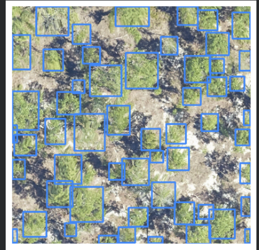
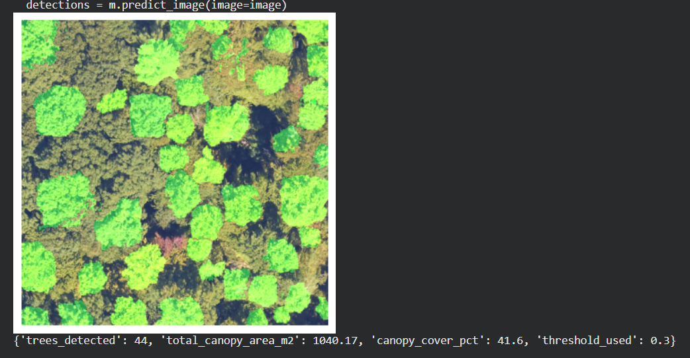
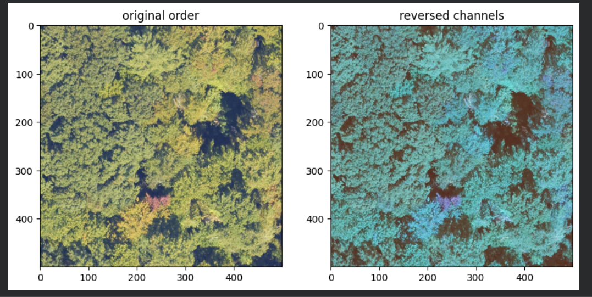

# Tree Crown Detection & Canopy Area Estimator

Point it at a forest, and it finds the trees.

This tool detects individual tree crowns in high-resolution RGB aerial/satellite imagery, segments each one precisely, and estimates canopy area and percent cover — built around a simple principle: **a rough tool that admits its limits beats a polished one that invents figures.** Every number this repo claims is backed by an actual test run, documented below with the real output.

**🔗 Live demo:** [https://tree-crown-detector-ejhvugksijnxndvpv3bpwh.streamlit.app/]

---

##  See it in action

Test images are included in this repo under [`example/`](./example) — you can run the live demo on them immediately, no need to source your own imagery first.

### Open canopy — clean detection


*DeepForest's raw output on a sparse/scrub forest scene (Ordway-Swisher Biological Station, FL). 55 candidate crowns detected, confidence up to 0.80 — clean, well-separated boxes on individual shrub/tree crowns.*

### Dense canopy — full pipeline result


*The complete pipeline (DeepForest → threshold → MobileSAM) on dense, closed-canopy NEON imagery. Green regions are real segmented crown shapes, not boxes — 44 trees detected, 41.6% canopy cover at threshold 0.3.*

### Dense canopy — where it struggles


*The same dense scene at a lower threshold. Notice the oversized boxes spanning multiple treetops — this is the merged-crown problem described in Limitations below, shown honestly rather than cropped out.*

---

##  How it works

1. Upload an RGB forest image (ideally ~10cm/pixel resolution or finer)
2. **DeepForest** (a pretrained RetinaNet, `weecology/deepforest-tree`) proposes candidate crowns as bounding boxes with confidence scores
3. Boxes below a user-adjustable confidence threshold are discarded
4. **MobileSAM** segments each remaining box into a real crown-shaped mask — not just the rectangle
5. Each mask's pixel area converts to real-world area via a user-supplied meters-per-pixel value, summed into total canopy area and cover %

The confidence threshold and resolution are live, adjustable inputs — not hardcoded — because (see below) there's no single value that's correct for every scene.

---

##  What we actually found

**Confidence drops sharply in dense canopy.** Top detection confidence was 0.80 on the open scrub scene, but only 0.69 on dense canopy, with most detections there sitting between 0.17–0.52. The model is genuinely less certain in harder scenes — a real, repeatable pattern, not noise.

**No single confidence threshold works across scene types.** Tested on the same dense-canopy image:

| Threshold | Trees kept | Canopy area | Canopy cover | Verdict |
|---|---|---|---|---|
| 0.5 | 5 / 59 | 95.4 m² | 3.8% | Clearly wrong — image is visually near-full canopy |
| 0.3 | 44 / 59 | 1040.2 m² | 41.6% | Plausible, likely still an undercount |
| 0.15 | 59 / 59 | 1248.5 m² | 49.9% | Recovers more real trees, likely reintroduces some false positives |

On the open scrub image, by contrast, 0.5 worked cleanly. **The "right" threshold depends on canopy density — there is no universal default.** The app defaults to 0.3 as a reasoned compromise (biased toward not missing real canopy, since undercounting is arguably the costlier error for something like carbon accounting), but the slider is there so nobody has to trust one hidden number.

**Segmentation-based area beats box-based area.** A bounding box always overestimates a round crown's true footprint. One validated single-crown mask came back at 22.86 m² (~2.7m radius) — a plausible size for a mature crown, confirming the pixel→m² math is sound at the individual-crown level.

---

## ⚠️ Known limitations (read before trusting the output)

- **Undercounts dense, closed canopy** via merged bounding boxes — see the third example image above. One segmented "crown" in dense canopy measured 62 m² against a typical single-crown size of 15–23 m² in the same image, almost certainly a merged cluster.
- **No single correct confidence threshold** — it's scene-dependent; the true count for the dense test image likely lies between the 0.3 and 0.15 results, not at either exactly.
- **Resolution (meters/pixel) must be entered accurately by the user.** The tool can't verify this value — a wrong number silently produces a wrong area.
- **Segmentation uses MobileSAM**, a compressed model chosen to fit free-tier hosting memory. Mask precision vs. full SAM hasn't been rigorously benchmarked.
- **Not validated against any ground-truth count.** All figures are model output, not field-verified measurements.
- **Tested on two scene types only** — one open scrub scene and one dense closed-canopy scene. Other forest types, sensors, or resolutions are untested.
- **Only tested on 500×500px crops.** Full-size raw tile behavior (e.g. a 10,000×10,000px NEON tile) is unverified.
- **Render's 512MB free tier couldn't run this stack even with MobileSAM** — the live deployment runs on Streamlit Community Cloud (~1GB), which was sufficient.

---

##  Tech stack

- **Detection:** DeepForest 2.1.0 (`weecology/deepforest-tree`, pretrained RetinaNet)
- **Segmentation:** MobileSAM (Tiny-ViT encoder)
- **UI:** Streamlit (deployed) / Gradio (alternate version included)
- **Test imagery:** DeepForest's bundled sample (`OSBS_029.png`) and NEON AOP RGB camera data (DP3.30010.001, 10cm/pixel)

##  Running locally

```bash
pip install -r requirements.txt
streamlit run app.py   # or: python app.py  for the Gradio version
```

The MobileSAM checkpoint downloads automatically on first run. Try it immediately on the images in `examples/` — no imagery sourcing required to see it work.
